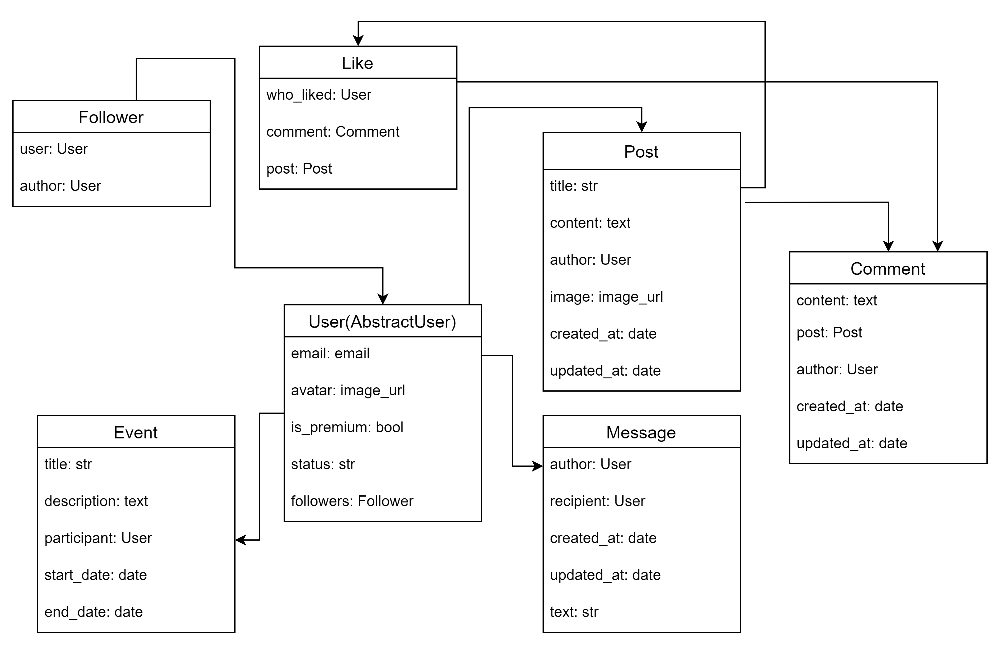

# Social Media Service API
API for social media platform.

API allow users to create profiles, follow other users, create and retrieve posts, messages and events, manage likes and comments, and perform basic social media actions.

## Technologies
- Django Rest Framework
- Celery + Redis for scheduled post creation
- Postgres
- Docker

## Run with Docker

***Docker must be already installed***

Copy .env-sample to .env and populate with all required data.

```shell
docker-compose up --build 
```
Note: superuser is created automatically with .env info if no users exist in database.

## Getting access🔓

Creating user:
/api/user/register/

Getting access token:
/api/user/token/

Logout: /api/user/logout

## Features ⭐
JWT authentication (with logout function)
- Admin panel via /admin/
- Documentation via /api/doc/swagger/
- Extended profile system for users
- Likes, comments, messages and following system
- CRUD operations for posts, comments, events and messages
- Upload media to post and user profile
- Retrieving posts by title, content and author
- Scheduled post creation
- Auto superuser creation on first launch

# database model: 


